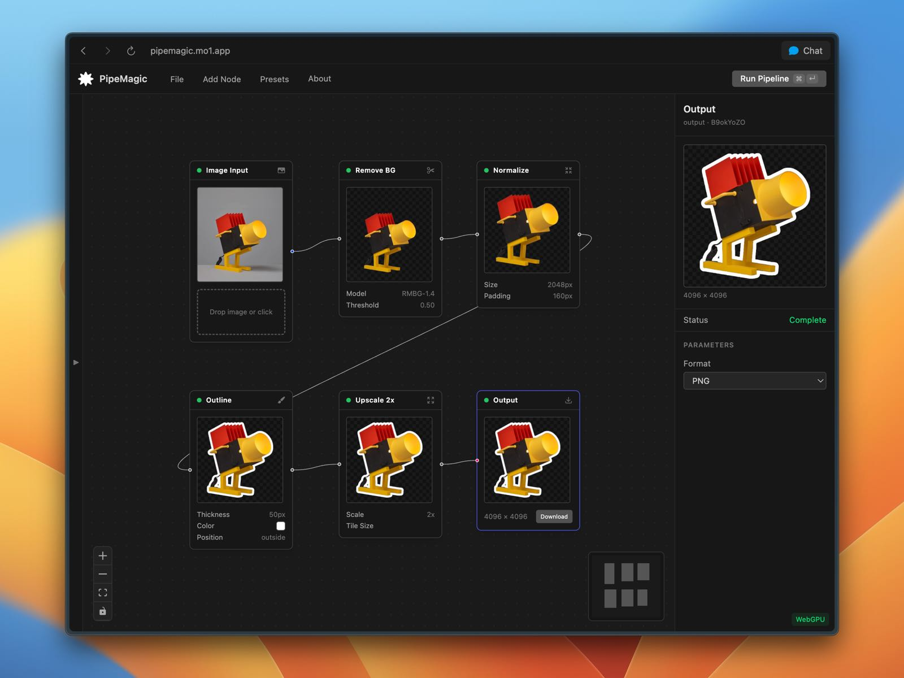

# PipeMagic

Visual image processing pipeline editor that runs entirely in the browser. Build node-based pipelines to process images using AI models — no server required.

**[Node Editor](https://pipemagic.mo1.app/)** · **[Example App](https://pipemagic.mo1.app/example/)** · **[npm Package](https://www.npmjs.com/package/pipemagic)**



## Runtime example

```ts
import { PipeMagic } from "pipemagic";

const pm = new PipeMagic();
const result = await pm.run(
  pipeline, // create these with the Node Editor
  imageFile,
);
// result.blob → output PNG
```

## Supported Nodes

- **Input** — Resize and fit source images
- **Remove BG** — AI background removal using [RMBG-1.4](https://huggingface.co/briaai/RMBG-1.4) via Transformers.js (WebGPU / WASM)
- **Normalize** — Auto-crop to content bounding box, center on square canvas with padding
- **Outline** — Configurable outline via Jump Flooding Algorithm on WebGPU, with canvas fallback
- **Estimate Depth** — Monocular depth estimation using [Depth Anything V2](https://huggingface.co/onnx-community/depth-anything-v2-small) via Transformers.js (WebGPU / WASM). Fast (~25 MB) and Quality (~40 MB) modes
- **Face Parse** — Face segmentation into 19 classes (skin, eyes, hair, etc.) using [face-parsing](https://huggingface.co/Xenova/face-parsing) via Transformers.js (WebGPU / WASM). Outputs a color-coded segmentation map
- **Upscale 2x** — Super-resolution with [WebSR](https://github.com/nicknbytes/websr) (Anime4K CNN models)
- **Output** — Encode to PNG / JPEG / WebP

## Packages

| Package                                 | Description                                                                                                                                                                            |
| --------------------------------------- | -------------------------------------------------------------------------------------------------------------------------------------------------------------------------------------- |
| [`packages/runtime`](packages/runtime/) | Standalone pipeline runtime, published as [`pipemagic`](https://www.npmjs.com/package/pipemagic) on npm. Framework-agnostic — use it in any web app to run image processing pipelines. |
| [`packages/example`](packages/example/) | Minimal demo app ([live](https://pipemagic.mo1.app/example/)). Vanilla Vite + TypeScript, ~180 lines. Drop an image and it runs the full sticker pipeline.                             |
| `app/`                                  | The main PipeMagic editor UI — Nuxt 3 / Vue 3 app with Vue Flow, Pinia, and Tailwind CSS. Imports the runtime from `pipemagic`.                                                        |
| `shared/types/`                         | TypeScript type definitions shared between the editor and the runtime.                                                                                                                 |

## Running locally

```bash
yarn install
yarn dev
```

Open [http://localhost:3003](http://localhost:3003).

To run the example app:

```bash
yarn build:runtime
yarn dev:example
```

Open [http://localhost:3005](http://localhost:3005).

## License

MIT
